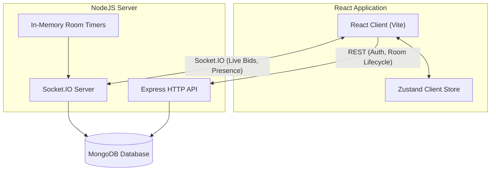

# System Architecture

This document describes the high-level architecture, data models, real-time event mapping, and concurrency mechanisms used in the Mini Realtime Auction Room platform.

---

## Architecture Overview

The platform uses a decoupled client-server architecture with state kept authoritative on the server and persisted in MongoDB.



### Components

1. **React Frontend**: Built with React 19, Vite, Tailwind CSS, and Zustand. State is synced dynamically via Socket.IO, but auth/login and initialization happen via REST API calls. Zustand is used purely for lightweight client-side convenience (e.g., maintaining the session room token).
2. **Express API**: Handles user authentication (JWT-based), creating/joining rooms, retrieving room summaries, and catalog initialization.
3. **Socket.IO Server**: Manages full-duplex realtime connections, participant presence (joined/left indicators), live bid submissions, and live active item status updates.
4. **In-Memory Room Timers**: The server schedules and tracks active-item countdowns in memory. When a timer expires, the server automatically resolves the item status.
5. **MongoDB**: The single source of truth for all database collections (Rooms, Participants, AuctionItems, Bids).

---

## Real-Time Socket.IO Lifecycle

Socket connections are room-scoped. The client sends a per-room `sessionToken` during the handshake, and the server joins the socket to a room channel (`room:{code}`).

### Event Map

| Event Name | Direction | Payload | Description |
|---|---|---|---|
| `room:connect` | Client → Server | `RoomConnectPayload` | Re-establishes a room session, triggering a full state synchronization. |
| `room:state` | Server → Client | `RoomStatePayload` | Emitted immediately after room connection; contains active item, participants list, and current bids. |
| `participant:joined` | Server → Client | `Participant` | Sent to the room channel when a new bidder connects. |
| `participant:left` | Server → Client | `Participant` | Sent to the room channel when a bidder disconnects or closes their tab. |
| `auction:start` | Client → Server | *None* | Emitted by the host to activate the auction lifecycle. |
| `auction:started` | Server → Client | *None* | Signals all participants in the room to transition from the Lobby to the Auction board. |
| `item:activated` | Server → Client | `AuctionItem` | Broadcasts details of the current active item and the synchronized countdown `endsAt`. |
| `bid:place` | Client → Server | `{ amount: number }` | Submitted by bidders to place a bid. |
| `bid:accepted` | Server → Client | `{ item: AuctionItem, bids: Bid[] }` | Broadcasts the updated highest bid and history to all room participants. |
| `bid:rejected` | Server → Client | `{ reason: string, minimumBid: number }` | Sent privately to the sender socket when a bid fails validation. |
| `item:sell` | Client → Server | *None* | Emitted by the host to manually resolve the active item as "sold". |
| `item:unsold` | Client → Server | *None* | Emitted by the host to manually resolve the active item as "unsold". |
| `item:ended` | Server → Client | `{ item: AuctionItem, resolution: "sold" \| "unsold" }` | Signals that the active item is resolved. |
| `auction:completed` | Server → Client | *None* | Signals that all catalog items are resolved and redirect participants to the results dashboard. |

---

## Concurrency and Race Conditions

Handling highly concurrent live bids and timer-expiration states is a core requirement of a robust auction engine. The system achieves complete correctness using server-authoritative logic and atomic database updates.

### 1. Atomic Bids (`findOneAndUpdate`)
When multiple bidders submit identical or incremental bids simultaneously, standard read-then-write patterns can cause double-bidding or accepting a bid below the minimum.
To prevent this, the server processes bids using a single conditional MongoDB query:
```typescript
const updatedItem = await AuctionItem.findOneAndUpdate(
  {
    _id: itemId,
    status: "active",
    endsAt: { $gt: new Date() },
    currentBid: { $lt: amount }
  },
  {
    $set: {
      currentBid: amount,
      highestBidderId: participantId
    }
  },
  { new: true }
);
```
Only one database execution can succeed in updating the document first; any concurrent execution racing against the same or lower amount will fail to match the query filter (`currentBid: { $lt: amount }`) and will return `null`. The loser is rejected gracefully and receive a `bid:rejected` event with the updated current minimum bid.

### 2. Item Resolution Races
An active item can be resolved in three ways:
1. The countdown timer expires naturally.
2. The Host clicks "Sell" manually.
3. The Host clicks "Mark Unsold" manually.

To prevent multiple resolutions from firing, the resolution state transition is also atomic:
```typescript
const resolvedItem = await AuctionItem.findOneAndUpdate(
  {
    _id: itemId,
    status: "active"
  },
  {
    $set: {
      status: resolution,
      endsAt: new Date()
    }
  },
  { new: true }
);
```
If the timer expires at the exact millisecond the host clicks "Sell", only one update operation transitions the status from `"active"` to `"sold"` (or `"unsold"`). The subsequent request will fail to match `status: "active"` and will instantly no-op, avoiding duplicate catalog progression or data corruption.

### 3. Server Resiliency & Timer Restoration
To avoid losing countdown timers on server crashes or restarts, the system saves the absolute `endsAt` timestamp of the active item to MongoDB. 
Upon startup, the server automatically queries all active rooms and schedules in-memory timeouts matching the remaining duration:
```typescript
// On server boot:
const liveRooms = await Room.find({ status: "live" });
for (const room of liveRooms) {
  if (room.currentItemId && room.endsAt) {
    const remainingMs = room.endsAt.getTime() - Date.now();
    scheduleAuctionTimer(io, room._id.toString(), Math.max(0, remainingMs));
  }
}
```

---

## Database Schema

```
┌─────────────────────────────────────────────────────────────┐
│                           rooms                             │
├─────────────────────┬──────────────────┬────────────────────┤
│ code (String, UQ)   │ status (Enum)    │ adminParticipantId │
│ name (String)       │ currentItemId    │ endsAt (Date)      │
└─────────────────────┴──────────────────┴────────────────────┘
                                   │
                                   ▼
┌─────────────────────────────────────────────────────────────┐
│                        auctionitems                         │
├─────────────────────┬──────────────────┬────────────────────┤
│ roomId (FK)         │ startingBid (No) │ status (Enum)      │
│ title (String)      │ currentBid (No)  │ endsAt (Date)      │
│ description (Str)   │ highestBidderId  │                    │
└─────────────────────┴──────────────────┴────────────────────┘
                                   ▲
                                   │
┌─────────────────────────────────────────────────────────────┐
│                            bids                             │
├─────────────────────┬──────────────────┬────────────────────┤
│ roomId (FK)         │ participantId    │ amount (Number)    │
│ itemId (FK)         │ username (String)│ createdAt (Date)   │
└─────────────────────┴──────────────────┴────────────────────┘
                                   ▲
                                   │
┌─────────────────────────────────────────────────────────────┐
│                        participants                         │
├─────────────────────┬──────────────────┬────────────────────┤
│ roomId (FK)         │ role (Enum)      │ isConnected (Bool) │
│ username (String)   │ sessionToken (UQ)│                    │
└─────────────────────┴──────────────────┴────────────────────┘
```

- **Unique Constraints**: `participants` has a compound unique index on `{ roomId, usernameNormalized }` to enforce unique nicknames within a room while allowing nick reuse across other rooms.
- **Session Security**: The host/bidder role is assigned server-side during room creation/joining and encoded inside a cryptographically secure `sessionToken`, which must match the participant record during socket handshakes.
