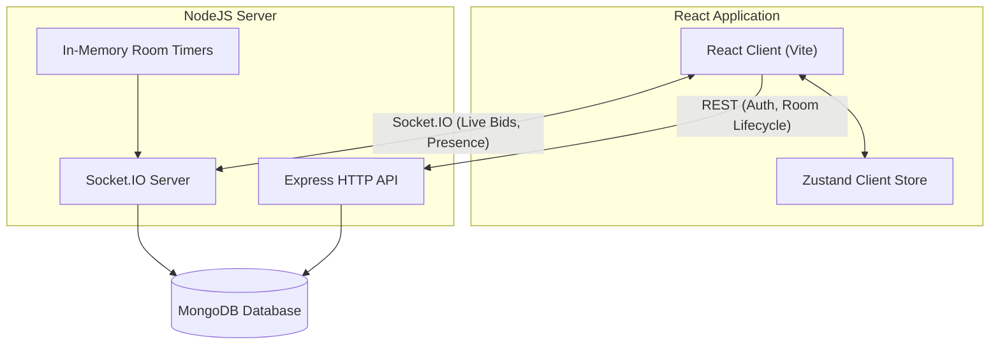

# System Architecture

This document describes the high-level architecture, data models, real-time event mapping, and concurrency mechanisms used in the Mini Realtime Auction Room platform.

---

## Architecture Overview

The platform uses a decoupled client-server architecture with state kept authoritative on the server and persisted in MongoDB.



### Components

1. **React Frontend**: Built with React 19, Vite, Tailwind CSS, and Zustand. State is synced dynamically via Socket.IO, but auth/login and initialization happen via REST API calls. Zustand is used purely for lightweight client-side convenience (e.g., maintaining the session room token).
2. **Express API**: Handles user authentication (JWT-based), creating/joining rooms, retrieving room summaries, and catalog initialization.
3. **Socket.IO Server**: Manages full-duplex realtime connections, participant presence (joined/left indicators), live bid submissions, and live active item status updates.
4. **In-Memory Room Timers**: The server schedules and tracks active-item countdowns in memory. When a timer expires, the server automatically resolves the item status.
5. **MongoDB**: The single source of truth for all database collections (Rooms, Participants, AuctionItems, Bids).

---

## Real-Time Socket.IO Lifecycle

Socket connections are room-scoped. The client sends a per-room `sessionToken` during the handshake, and the server joins the socket to a room channel (`room:{code}`).

### Event Map

| Event Name | Direction | Payload | Description |
|---|---|---|---|
| `room:connect` | Client → Server | *None* | Sent after every connect. Identity comes from the handshake, so no payload is needed. Triggers a full state synchronization. |
| `room:state` | Server → Client | `{ room, participants, activeItem, bids, items, serverTime }` | Sent only to the requesting socket. `activeItem` and `bids` are populated when the room is live; `serverTime` lets the client measure its clock offset. |
| `participant:joined` | Server → Client | `{ participant }` | Broadcast to the rest of the room when a bidder comes online. Not re-sent for a second tab. |
| `participant:left` | Server → Client | `{ participant }` | Broadcast when a bidder's last socket disconnects. |
| `item:added` | Server → Client | `{ item }` | Emitted from the REST item handler so lobby catalogs update without a refetch. |
| `auction:start` | Client → Server | *None* | Host only. Moves the room from `lobby` to `live`. |
| `auction:started` | Server → Client | `{ room }` | Tells every client to move from the lobby to the auction board. |
| `item:activated` | Server → Client | `{ item, startedAt, endsAt }` | The new active item plus the server's clock at activation and the absolute deadline. |
| `auction:pause` | Client → Server | *None* | Host only. Freezes the countdown on the active item. |
| `auction:paused` | Server → Client | `{ itemId, remainingMs }` | Broadcast when the clock stops. `remainingMs` is what the client renders in place of a live countdown. |
| `auction:resume` | Client → Server | *None* | Host only. Restarts the countdown from where it stopped. |
| `auction:resumed` | Server → Client | `{ item, endsAt, serverTime }` | Broadcast with the new absolute deadline and the server clock for offset correction. |
| `bid:place` | Client → Server | `{ amount: number }` | Bidders only. Hosts are rejected. |
| `bid:accepted` | Server → Client | `{ bid, item }` | Broadcast to the room. `item` carries the new highest bid and the extended `endsAt`. |
| `bid:rejected` | Server → Client | `{ reason: string, minimumBid: number }` | Sent only to the submitting socket. |
| `item:sell` | Client → Server | *None* | Host only. Requires at least one accepted bid. |
| `item:unsold` | Client → Server | *None* | Host only. Clears any recorded highest bidder. |
| `item:ended` | Server → Client | `{ item, resolution: "sold" \| "unsold", winner }` | The item was resolved, by the host or by expiry. `winner` is the debited participant on a sale, `null` otherwise. |
| `auction:completed` | Server → Client | `{ room }` | No pending items remain; clients redirect to results. |
| `error` | Server → Client | `{ message: string }` | Sent only to the offending socket for authorization and lifecycle failures. |

---

## Concurrency and Race Conditions

Handling highly concurrent live bids and timer-expiration states is a core requirement of a robust auction engine. The system achieves complete correctness using server-authoritative logic and atomic database updates.

### 1. Atomic Bids (`findOneAndUpdate`)
When multiple bidders submit identical or incremental bids simultaneously, a read-then-write pattern can accept two winners or a bid below the current minimum. The server instead resolves each bid with one conditional update:

```typescript
const newEndsAt = new Date(Date.now() + env.auctionItemDurationSeconds * 1000);

const updatedItem = await AuctionItem.findOneAndUpdate(
  {
    _id: activeItem._id,
    status: "active",
    isPaused: false,
    endsAt: { $gt: new Date() },
    startingBid: { $lte: amount },   // may open at the asking price
    currentBid: { $lt: amount },     // must beat the standing highest
  },
  {
    $set: {
      currentBid: amount,
      highestBidderId: participant._id,
      highestBidderUsername: participant.username,
      endsAt: newEndsAt,
    },
  },
  { new: true },
);
```

Only one execution can match `currentBid: { $lt: amount }`; any concurrent bid at the same or a lower amount fails the filter and returns `null`. The loser receives `bid:rejected` with the new minimum.

The same update extends the deadline. An accepted bid restores the full countdown, so a bid landing in the final second cannot win uncontested — see [DECISIONS.md](DECISIONS.md) for that trade-off.

**Write ordering.** The `bids` collection is an append-only log, and an entry is written *only after* the claim succeeds. Writing it first and deleting it on failure would make a rejected bid briefly readable by a concurrent `room:connect`, and would orphan it permanently if the process died between the write and the compensating delete.

### 2. Item Resolution Races
An active item can be resolved three ways: the countdown expires, the host sells, or the host marks it unsold. The transition is claimed conditionally so only one can win:

```typescript
const claim: Record<string, unknown> = { _id: activeItem._id, status: "active" };

// An expiry must also prove the deadline has actually elapsed.
if (requestedResolution === "expired") {
  claim.endsAt = { $lte: new Date() };
}

const resolvedItem = await AuctionItem.findOneAndUpdate(
  claim,
  { $set: update },
  { new: true },
);
```

If the timer fires at the same millisecond the host clicks Sell, exactly one update moves the status off `"active"`; the other fails the filter and no-ops, so the catalog cannot advance twice.

The extra `endsAt` condition on the expiry path closes a subtler race. A bid accepted moments before expiry pushes `endsAt` into the future and reschedules the timer — but `clearTimeout` cannot recall a callback that has already fired and is awaiting its database reads. Without the elapsed-deadline check, that stale callback still matches on status alone and ends an item the bid had just extended, cutting short the very countdown the extension exists to protect. Host-initiated resolutions stay unconditional, because ending an item early is exactly what the host is asking for.

If an expiry loses the claim because the deadline moved, the callback re-arms a timer from the persisted deadline, so an active item is never left without one.

### 3. Server Resiliency & Timer Restoration
Timers are in-memory, but deadlines are persisted as absolute timestamps. On boot the server rebuilds a timer for every live room:

```typescript
const liveRooms = await Room.find({
  status: "live",
  currentItemId: { $ne: null },
});

for (const room of liveRooms) {
  const endsAt = room.endsAt ?? getAuctionEndsAt(Date.now(), env.auctionItemDurationSeconds);
  scheduleAuctionTimer(io, room._id.toString(), endsAt);
}
```

A deadline already in the past yields a zero delay, so the item resolves immediately on startup rather than hanging.

### 4. Pausing Without Losing the Deadline

The countdown is an absolute timestamp, not a ticking counter, so pausing cannot simply "stop the clock" — there is no clock to stop. Instead the pause converts the deadline back into a duration:

```typescript
// `new: false` returns the document as it was at the instant of the swap, which
// is the only trustworthy reading of endsAt: a separate read could observe a
// value a concurrent bid had already extended.
const beforePause = await AuctionItem.findOneAndUpdate(
  { _id: itemId, status: "active", isPaused: false, endsAt: { $gt: new Date() } },
  { $set: { isPaused: true, endsAt: null } },
  { new: false },
);

const remainingMs = beforePause.endsAt.getTime() - Date.now();
```

The remainder is stored on the room, the in-memory timer is cleared, and resuming sets `endsAt` to `now + remainingMs` and re-arms it.

Three properties fall out of this:

- **Pausing closes bidding at the database.** `isPaused: false` is part of the bid claim, not merely a check before it, so a pause landing between the read and the update cannot let one last bid slip through after the clock has visibly stopped for everyone.
- **A paused item cannot expire.** `endsAt` is `null` while frozen, and `null` never satisfies `$lte` against a date, so the expiry claim finds nothing however long the pause lasts.
- **A double click is harmless.** The pause is itself a conditional claim on `isPaused: false`, so only one of two simultaneous requests can win and the remaining time is computed exactly once.

Restart recovery skips paused rooms entirely: with no deadline there is nothing to count down, and the host's resume is what re-arms the timer.

### 5. Budgets: Validate at Bid Time, Charge at Sale Time

Every bidder holds a purse (`budget`) and a running total (`spent`). A bid is rejected if it exceeds `budget - spent`; the winner is debited with a single `$inc` when the item resolves as sold.

**Why not reserve funds when the bid is placed?** Because every outbid participant would then need a refund, and a refund that fails leaves a purse permanently wrong. Charging at resolution means exactly one writer per item and no compensating transaction.

**Why is the budget check outside the atomic claim?** The claim operates on the item; the purse lives on the participant, and a single `findOneAndUpdate` cannot condition on both. That is safe here only because **exactly one item is live at a time**, so a bidder can hold at most one outstanding commitment. `spent` cannot move between the check and the claim except by an item resolving — which would fail the claim anyway on `status: "active"`.

That assumption is load-bearing. Auctioning several items simultaneously would break it: two bids could each pass the check and together exceed the purse. The fix then is a conditional decrement on the participant, `{ _id, $expr: { $gte: [{ $subtract: ["$budget", "$spent"] }, amount] } }`, reserving at bid time and refunding on outbid — which is precisely the complexity the sequential design avoids.

### 6. Presence After a Restart
Presence is tracked two ways: an in-memory map of participant id to live socket ids, which allows multiple tabs without duplicate join broadcasts, and an `isConnected` flag persisted on the participant so `room:state` can render the roster. A restart loses the map but not the flag, which would leave every previous bidder shown as permanently online. Startup therefore clears all `isConnected` flags before restoring timers; live clients re-register on their next `room:connect`.

### 7. Database Availability
MongoDB is treated as a runtime dependency, not a startup precondition. The HTTP port binds first and the connection retries with exponential backoff, so an unreachable database degrades the API instead of failing the deploy. While disconnected, both entry points refuse work at the door — REST returns `503` and the socket handshake rejects with the same explanation — rather than letting queries sit in Mongoose's buffer until it times out.

---

## Database Schema

```
┌─────────────────────────────────────────────────────────────┐
│                            users                            │
│  Global accounts. Not linked to rooms: identity is global,  │
│  room role is not.                                          │
├─────────────────────┬──────────────────┬────────────────────┤
│ username (String)   │ passwordHash     │ salt (String)      │
│ usernameNormalized  │                  │                    │
│   (String, UQ)      │                  │                    │
└─────────────────────┴──────────────────┴────────────────────┘

┌─────────────────────────────────────────────────────────────┐
│                           rooms                             │
├─────────────────────┬──────────────────┬────────────────────┤
│ code (String, UQ)   │ status (Enum)    │ adminParticipantId │
│ name (String)       │ currentItemId    │ endsAt (Date)      │
└─────────────────────┴──────────────────┴────────────────────┘
                                   │
                                   ▼
┌─────────────────────────────────────────────────────────────┐
│                        auctionitems                         │
├─────────────────────┬──────────────────┬────────────────────┤
│ roomId (FK)         │ startingBid (No) │ status (Enum)      │
│ title (String)      │ currentBid (No)  │ endsAt (Date)      │
│ description (Str)   │ highestBidderId  │                    │
└─────────────────────┴──────────────────┴────────────────────┘
                                   ▲
                                   │
┌─────────────────────────────────────────────────────────────┐
│                            bids                             │
├─────────────────────┬──────────────────┬────────────────────┤
│ roomId (FK)         │ participantId    │ amount (Number)    │
│ itemId (FK)         │ username (String)│ createdAt (Date)   │
└─────────────────────┴──────────────────┴────────────────────┘
                                   ▲
                                   │
┌─────────────────────────────────────────────────────────────┐
│                        participants                         │
├─────────────────────┬──────────────────┬────────────────────┤
│ roomId (FK)         │ role (Enum)      │ isConnected (Bool) │
│ username (String)   │ sessionToken (UQ)│                    │
└─────────────────────┴──────────────────┴────────────────────┘
```

- **Unique constraints**: `participants` carries a compound unique index on `{ roomId, usernameNormalized }`, enforcing unique names within a room while allowing the same name across rooms. The application also pre-checks for a taken name, but that check is a read-then-write race; the index is the real guard and its duplicate-key error is translated back into the same message.
- **Supporting indexes**: `{ itemId, createdAt }` on `bids` for the newest-first log, and `{ roomId, status, createdAt }` on `auctionitems` for the catalog listing and the conditional claim of the next pending item.
- **Session security**: The host/bidder role is assigned server-side at room creation or join and bound to a random `sessionToken`, which must match a participant record during the socket handshake. The token is stripped from every participant list sent to clients.
- **Two identity layers**: the JWT cookie identifies the account across the app; the `sessionToken` identifies membership and role inside one room. They are deliberately separate so one account can host one room and bid in another.
