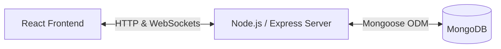

# Realtime Auction Rooms

Realtime Auction Rooms is a full-stack, server-authoritative auction platform. It enables hosts to spin up private bidding rooms, configure item catalogs, and manage live auctions, while participants join and submit concurrent bids with sub-second feedback. 

The platform utilizes a reactive state model with Socket.IO communication, backed by MongoDB for server-authoritative concurrency and crash recovery.

---

## Key Features

- **Dynamic Room Management**: Instantly create and join auction rooms using secure room codes.
- **Server-Authoritative Concurrency**: Leverages atomic MongoDB updates (`findOneAndUpdate`) to prevent race conditions from concurrent bidders.
- **Synced Countdown Engine**: Server-owned auction timers are persisted as absolute deadlines, enabling mid-auction server restarts to recover and resume timers without loss of time.
- **Real-Time Presence Tracking**: Dynamic online/offline presence indicators for all participants.
- **Comprehensive Bid Logs**: Live bid histories updated in real time for all participants.
- **Instant Item Resolution**: Supports manual resolutions (Sell/Mark Unsold) by the host, as well as auto-sell on timer expiration.
- **Analytical Results Dashboard**: Displays final auction summaries, sales records, and bid logs upon auction completion.

---

## Tech Stack

- **Frontend:** React 19, TypeScript, Vite, Tailwind CSS, Zustand, Socket.IO Client
- **Backend:** Node.js, Express 5, TypeScript, Mongoose, Socket.IO
- **Database:** MongoDB
- **Testing:** Node.js Native Test Runner

---

## Architecture Overview

The system uses a decoupled client-server architecture. All state transitions are validated on the backend and broadcasted to connected clients.



For a detailed walkthrough of the concurrency controls, socket lifecycles, and database schemas, see [ARCHITECTURE.md](file:///Users/arnavsingla/Desktop/Intern%20assignments/11-Auction-Assignment/Mini%20Realtime%20Auction%20Room/ARCHITECTURE.md).

---

## Folder Structure

```
├── backend
│   ├── src
│   │   ├── config          # Database, CORS, and Environment variables configuration
│   │   ├── controllers     # HTTP controllers handling auth, items, and rooms
│   │   ├── models          # MongoDB schemas (Bid, Item, Participant, Room, User)
│   │   ├── middleware      # Auth checks, error handling
│   │   ├── routes          # REST API endpoints
│   │   ├── services        # Core business logic (rooms, items)
│   │   ├── socket          # Socket.IO connections, handlers, and middlewares
│   │   └── utils           # Helper functions & test suites
│   └── package.json
└── frontend
    ├── src
    │   ├── app             # Router, providers, and layout setups
    │   ├── components      # Shared UI elements & Design layout
    │   ├── features        # Feature modules (Lobby, Auth, Auction, Results)
    │   ├── pages           # Router page templates
    │   ├── services        # API Client and WebSocket wrappers
    │   └── stores          # Zustand client-side state stores
    └── package.json
```

---

## Running Locally

### Prerequisites

- **Node.js** 18+
- **MongoDB** (Local instance or MongoDB Atlas Connection String)

### Step 1: Clone and Configure Backend

1. Navigate to the backend directory:
   ```bash
   cd backend
   ```
2. Install dependencies:
   ```bash
   npm install
   ```
3. Copy environment template and configure:
   ```bash
   cp .env.example .env
   ```
   Modify `.env` to include your MongoDB URI and set a secure `JWT_SECRET` for production:
   ```env
   PORT=3001
   MONGODB_URI=mongodb://localhost:27017/auction-room
   JWT_SECRET=your_jwt_secret_here
   ```

### Step 2: Configure Frontend

1. Navigate to the frontend directory:
   ```bash
   cd ../frontend
   ```
2. Install dependencies:
   ```bash
   npm install
   ```
3. Copy environment template:
   ```bash
   cp .env.example .env
   ```
   Ensure the API URL matches your running backend:
   ```env
   VITE_API_URL=http://localhost:3001
   ```

### Step 3: Run the Services

1. **Start the Backend server** (runs on port 3001 by default):
   ```bash
   cd backend
   # Starts in watch mode
   npm run dev
   ```
2. **Start the Frontend development server** (runs on port 5173 by default):
   ```bash
   cd frontend
   npm run dev
   ```
3. Open `http://localhost:5173` in your browser.

---

## Demo & Testing Guide

For quick testing, you can use the built-in demo credentials on the login screen or register an anonymous alias (guest mode).

### Testing the Concurrent Auction Lifecycle

1. **Setup Catalog**: Log in as Host A, create a room, and add at least two items to the catalog.
2. **Join Bidders**: Open an Incognito Window or separate browser profile, register a bidder alias, and join using the room code generated by Host A.
3. **Launch Auction**: Host A clicks **Start Live Auction**. Both screens will synchronize and transition into the Live Auction Dashboard.
4. **Place Bids**: Submit bids from multiple tabs simultaneously. Verify that only higher bids are accepted, and lower or concurrent slower bids are rejected atomically with real-time feedback.
5. **Item Completion**: When the timer expires or the host resolves the item, the system automatically loads the next item in the catalog.
6. **Results**: Once all items are resolved, all connected clients navigate automatically to the final results screen.

---

## API Documentation

### Authentication Endpoints

- `POST /api/auth/register` - Create a new user account.
- `POST /api/auth/login` - Authenticate and obtain JWT cookie.
- `POST /api/auth/logout` - Clear user authentication cookie.
- `GET /api/auth/me` - Get the current authenticated user context.

### Room Endpoints

- `POST /api/rooms` - Create a new auction room.
- `POST /api/rooms/:code/join` - Join an existing room with a code and alias.
- `GET /api/rooms/:code/summary` - Get details of an active room.
- `GET /api/rooms/:code/results` - Fetch final results of a completed room auction.

### Item Endpoints

- `POST /api/items` - Add a new item to a room's catalog.
- `GET /api/items/room/:roomId` - Retrieve catalog items for a room.

---

## Future Roadmap

- **Team Bidding Budgets**: Group budgets and spend caps for collaborative bidding structures.
- **Live Chat & Reactions**: Enhance bidder engagement with interactive channels on the auction page.
- **Horizontal Scaling**: Transition the WebSocket layer to a Redis-backed Socket.IO adapter for multi-instance load balancing.
- **Bidding Pause/Resume Controls**: Empower hosts to pause and resume active countdowns.
- **Spectator Support**: Allow read-only viewer roles to follow live auctions without participating.

---

## License

This project is licensed under the MIT License.
