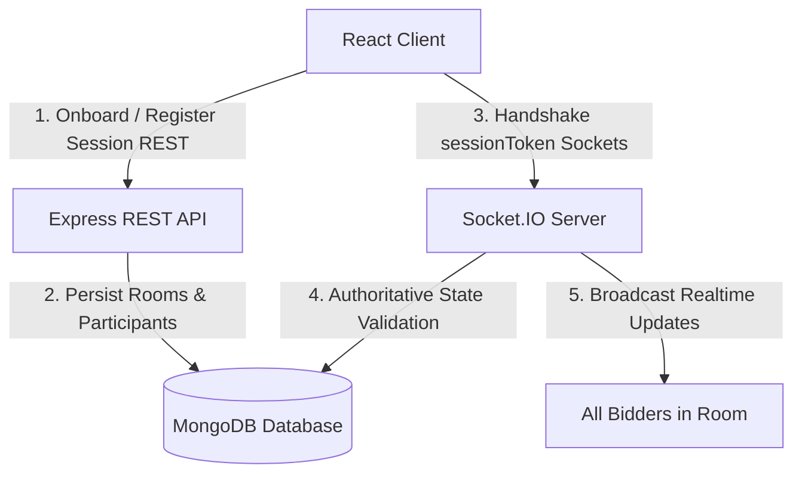

# Mini Realtime Auction Room

A premium, modern, and secure realtime auction platform built with a dark Vercel/Linear-inspired SaaS aesthetic. The application utilizes a hybrid REST + authoritative WebSockets architecture to synchronize participant presence, catalog additions, bid entries, and item resolutions in real-time.

**Live Demo URL**: [https://auction-assignment.vercel.app/](https://auction-assignment.vercel.app/)

---

## 1. Demo Credentials

Directly on the login page portal, you can access the platform using:
* **Unified Demo Account**: Click **"Use Demo Account"** to instantly sign in with:
  * **Username**: `demo`
  * **Password**: `password123`
* **Custom Guest Login**: Enter any custom alias username in the text field to sign in as a guest.

*Once logged in, the dashboard allows you to either **Create Auction Room** (where you become the room's host/admin) or **Join Existing Room** (where you join as a participant bidder).*

---

## 2. Technology Stack

* **Frontend**: React 18, TypeScript, Vite, Zustand (for persisted local storage state management), and Vanilla CSS / Tailwind (for customized dark layouts).
* **Backend**: Node.js, Express, TypeScript, and MongoDB (via Mongoose ODM).
* **Realtime Sockets**: Socket.IO (v4) with authoritative server handshake validations.
* **Database**: MongoDB (Local or Atlas clusters) with compound unique indexes.

---

## 3. Architecture & Design



The system splits concerns between REST APIs and WebSockets to maximize reliability and efficiency:
1. **REST APIs (Data & Session Creation)**:
   * Handles user onboarding (room creation and bidder validation).
   * Generates a unique `sessionToken` stored in the database and the client's `localStorage` (via Zustand).
   * Manages static data entry (adding auction items by admin) and query results.
2. **Socket.IO (Volatile Realtime Updates)**:
   * During connection setup, the handshake payload contains the `sessionToken` and `roomCode`.
   * A custom backend middleware queries MongoDB to validate that the token matches the active room before authorizing connection.
   * Handles user presence synchronization (`isConnected: true/false`), room status progression (lobby to live, sell/unsold resolutions), bidding validation, and completion broadcasts.
3. **Database-Driven Persistence**:
   * All state is written to MongoDB. In the event of network disruption, clients reconnecting to the socket request the room's current state, which the server reconstructs on the fly by reading MongoDB records.

---

## 4. Database Design

We declare four collections in MongoDB:

### Room
* `code`: String (6 characters, unique index, uppercase)
* `name`: String
* `status`: String (`'lobby' | 'live' | 'completed'`)
* `adminParticipantId`: ObjectId (ref `Participant`)
* `currentItemId`: ObjectId (ref `AuctionItem`, default null)

### Participant
* `roomId`: ObjectId (ref `Room`)
* `username`: String (Unique per room via compound unique index `{ roomId: 1, username: 1 }`)
* `role`: String (`'admin' | 'participant'`)
* `sessionToken`: String (UUID, unique index)
* `isConnected`: Boolean (default false)

### AuctionItem
* `roomId`: ObjectId (ref `Room`)
* `name`: String
* `description`: String (optional)
* `startingBid`: Number (strictly positive)
* `currentBid`: Number (defaults to starting price)
* `highestBidderId`: ObjectId (ref `Participant`, default null)
* `highestBidderUsername`: String (default null)
* `status`: String (`'pending' | 'active' | 'sold' | 'unsold'`)

### Bid
* `roomId`: ObjectId (ref `Room`)
* `itemId`: ObjectId (ref `AuctionItem`)
* `participantId`: ObjectId (ref `Participant`)
* `username`: String
* `amount`: Number (strictly positive)

---

## 5. Socket.IO Event Registry

### Client → Server
* `room:connect`: Registers presence status, joins the client to the virtual Socket room, and triggers initial state recovery (`room:state`).
* `auction:start`: Sent by the room host to start the auction (takes room from `lobby` to `live` and activates the first item).
* `bid:place`: Sent by a bidder to place a bid on the active item (payload: `{ amount }`).
* `item:sell`: Sent by the host to mark the active item as sold.
* `item:unsold`: Sent by the host to resolve the active item as unsold.

### Server → Client
* `room:state`: Emitted upon connection. Returns `room`, `participants`, `activeItem`, and `bids` history logs.
* `participant:joined` / `participant:left`: Broadcasts presence update notifications.
* `auction:started`: Notifies clients that the auction is live, prompting automatic route transitions.
* `item:activated`: Notifies clients that a new item is open for bidding.
* `bid:accepted` / `bid:rejected`: Emits bid responses. `accepted` goes to everyone to sync highest bid; `rejected` goes only to the placing client.
* `item:ended`: Broadcasts the resolution of the item (sold/unsold).
* `auction:completed`: Broadcasts that the room is resolved, triggering redirect to results screen.

---

## 6. Local Setup

### Prerequisites
* Node.js (v18+)
* MongoDB Compass or active MongoDB Atlas URI

### Installation & Run

1. **Clone the Repository** and open it in your terminal.
2. **Setup Environment Variables**:
   * Copy the root `.env.example` to `backend/.env` and edit `MONGODB_URI` to point to your database.
   * Copy `.env.example` to `frontend/.env` (Vite parses frontend environment files).
3. **Run Backend**:
   ```bash
   cd backend
   npm install
   npm run build
   npm start
   ```
4. **Run Frontend**:
   ```bash
   cd frontend
   npm install
   npm run dev
   ```
5. **Open Browser**: Navigate to `http://localhost:5173`.

---

## 7. Hosting & Deployment Guidelines

This project is a monorepo containing distinct `backend` and `frontend` folders:

### Backend (Render Web Service)
* **Root Directory**: `backend`
* **Build Command**: `npm install && npm run build`
* **Start Command**: `node server.js`
* **Environment Variables**:
  * `NODE_ENV`: `production`
  * `MONGODB_URI`: (Your MongoDB Atlas connection string)
  * `CLIENT_URL`: `https://auction-assignment.vercel.app` (Your Vercel URL)
  * `JWT_SECRET`: (Your custom secure cookie secret)

### Frontend (Vercel Web App)
* **Framework Preset**: `Vite`
* **Root Directory**: `frontend`
* **Build Command**: `npm run build`
* **Output Directory**: `dist`
* **Install Command**: `npm install`
* **Environment Variables**:
  * `VITE_API_URL`: `https://auction-assignment-backend.onrender.com/api` (Your Render backend endpoint)

---

## 8. AI Usage Notes

This application was engineered iteratively under **Planning Mode** using **Google DeepMind's Advanced Agentic Coding assistant, Antigravity**. Brief logs, prompts, and summary files outlining core design decisions are located in the `ai-transcripts/` directory.
