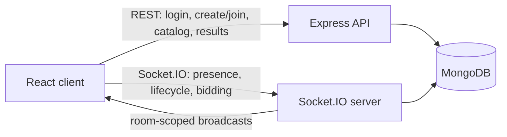

# Mini Realtime Auction Room

A full-stack, server-authoritative auction application (Assignment Option 3). Hosts create a room and prepare its catalog; bidders join with a room code, receive catalog and auction updates through Socket.IO, and place bids on the active item. MongoDB is the durable source of truth, so a reload recovers the current room state.

## Live Demo

[auction-assignment.vercel.app](https://auction-assignment.vercel.app/)

> Before submitting, confirm the backend host is awake and reachable from the deployed frontend (see [Known Limitations](#known-limitations) — free-tier hosts can cold-sleep).

## Demo Credentials

| Account     | Username  | Password      | Notes                                                                          |
| ----------- | --------- | ------------- | ------------------------------------------------------------------------------ |
| Host demo   | `admin`   | `password123` | Global login only; room role is still decided by create/join, not this account |
| Bidder demo | `demo`    | `password123` | One-click button on the login screen                                           |
| Guest       | any alias | _(none)_      | Public demo mode — any non-reserved username logs in without a password        |

Room-level role (host vs. bidder) is assigned by the server based on whether you **create** or **join** a room — not by which demo account you log in with. Log in once, then create one room and join it again from a second browser profile/incognito window with a different alias to see both roles.

## Tech Stack

- **Frontend:** React 19, TypeScript, Vite, Tailwind CSS, Zustand
- **Backend:** Node.js, Express 5, TypeScript, Mongoose
- **Realtime:** Socket.IO
- **Database:** MongoDB

## Features

### Core features (required by the assignment) — all present

| Requirement                  | Status | Where                                                          |
| ---------------------------- | ------ | -------------------------------------------------------------- |
| Create auction room          | ✅     | `POST /api/rooms` → `room.service.createRoom`                  |
| Join room by code/link       | ✅     | `POST /api/rooms/:code/join`                                   |
| Admin and participant roles  | ✅     | Server-assigned on create/join, never client-supplied          |
| Item/player list             | ✅     | `AuctionItem` model + lobby catalog UI                         |
| Start auction                | ✅     | `auction:start` socket event, admin-only                       |
| Current item/player display  | ✅     | `item:activated` broadcast + auction page                      |
| Countdown timer              | ✅     | Server-owned `setTimeout` per room, restored on server restart |
| Realtime bidding             | ✅     | `bid:place` → atomic conditional update                        |
| Bid history                  | ✅     | `Bid` collection, live list on the auction page                |
| Sold/unsold outcome          | ✅     | `item:sell` / `item:unsold` + automatic timer expiry           |
| Final results page           | ✅     | `/results/:code`, auto-navigated to on completion              |
| Basic room state persistence | ✅     | MongoDB-backed; `room:connect` rehydrates state on reload      |

Auction flow matches the expected `LOBBY -> AUCTION -> COMPLETED` states, and the realtime minimums (live bids, live active item, synced timer, results without refresh) are all implemented — see [Realtime Design](#realtime-design).

### Optional features — implemented

- **Presence indicators** — connected/offline badges per participant, tracked per-socket so multiple tabs under one login don't falsely show "offline".

### Optional features — not implemented (acceptable; these were explicitly optional)

- Skip/withdraw voting
- Team/squad budgets or spending caps
- Maximum items per user / role caps
- Chat/reactions
- Public/private rooms
- Auction pause/resume
- Spectator mode

None of these are required by the brief. They're listed here so it's clear they were a deliberate scope cut, not an oversight, and they're the natural next additions — see [Future Improvements](#future-improvements).

## Architecture



- REST creates durable data and returns a per-room `sessionToken` after a room is created or joined.
- A separate, short-lived JWT cookie (`/api/auth/login`) tracks global "who is logged in" identity across the site; it does **not** decide room permissions. Room role (`admin`/`participant`) is always assigned server-side by `room.service.ts` based on whether the request created or joined the room.
- Socket.IO authenticates the per-room `sessionToken` during its handshake, joins the client to `room:{code}`, and broadcasts room events only to that room.
- The server validates host permissions, item status, and bid amounts before persisting changes and broadcasting them.
- The browser persists its current room session with Zustand (`localStorage`). This is convenience state for reconnect, not the authoritative auction state — the server always rehydrates from MongoDB on `room:connect`.

## Realtime Design

### Events

| Direction       | Event                                    | Purpose                                                      |
| --------------- | ---------------------------------------- | ------------------------------------------------------------ |
| Client → server | `room:connect`                           | Join the room channel and request a fresh state snapshot     |
| Client → server | `auction:start`                          | Host starts the auction and activates the first pending item |
| Client → server | `bid:place`                              | Bidder submits a bid amount for server validation            |
| Client → server | `item:sell`, `item:unsold`               | Host resolves the active item                                |
| Server → client | `room:state`                             | Fresh room, participant, active-item, and bid snapshot       |
| Server → client | `participant:joined`, `participant:left` | Presence changes                                             |
| Server → client | `item:added`                             | A host-added catalog item                                    |
| Server → client | `auction:started`, `item:activated`      | Auction and active-item transitions                          |
| Server → client | `bid:accepted`, `bid:rejected`           | Accepted room-wide update or private validation error        |
| Server → client | `item:ended`, `auction:completed`        | Resolution and completion updates                            |

### Concurrency handling (the part the assignment weighs most heavily)

- **Bids** are accepted with a single conditional Mongo update: `findOneAndUpdate({ _id, status: "active", endsAt: { $gt: now }, currentBid: { $lt: amount } }, ...)`. Two bidders racing on the same amount can only ever have one `findOneAndUpdate` match; the loser is rejected with the real current price, not a stale one.
- **Item resolution** (sell/unsold/expiry) uses the same pattern: `findOneAndUpdate({ _id, status: "active" }, ...)`. Whether the resolution is triggered by the host clicking "Sell", the host clicking "Mark Unsold", or the server's own timer firing, only one of those can win if they land at the same moment — the others no-op instead of double-resolving or double-advancing the catalog.
- **The countdown is server-owned**, not client-owned: the server schedules a `setTimeout` per live room and stamps an absolute `endsAt` that all clients render from. On server restart, `restoreAuctionTimers()` reloads all `live` rooms from MongoDB and re-arms timers from the persisted `endsAt`, so a restart mid-auction doesn't lose the deadline.
- **Bid validation is entirely server-side** — clients only ever emit an intent (`bid:place`, `item:sell`, …) and the server decides.

## Database Schema

| Collection     | Purpose                                               | Key fields                                                                                                        |
| -------------- | ----------------------------------------------------- | ----------------------------------------------------------------------------------------------------------------- |
| `rooms`        | Room code, name, lifecycle status, host, active item  | `code`, `status` (`lobby`/`live`/`completed`), `adminParticipantId`, `currentItemId`, `endsAt`                    |
| `participants` | Room membership, role, opaque session token, presence | `roomId`, `username`, `usernameNormalized`, `role`, `sessionToken`, `isConnected`                                 |
| `auctionitems` | Catalog entries, current/highest bid, winner, status  | `roomId`, `startingBid`, `currentBid`, `highestBidderId`, `status` (`pending`/`active`/`sold`/`unsold`), `endsAt` |
| `bids`         | Accepted bid history for an item                      | `roomId`, `itemId`, `participantId`, `username`, `amount`                                                         |

`participants` has a compound unique index on `{ roomId, usernameNormalized }` so the same alias can be reused across different rooms but not twice in the same room.

## AI Usage

Tools used, prompts, and transcripts are in [`ai-transcripts/`](ai-transcripts/):

- `chatgpt-session-1.md` — architecture and milestone prompts
- `cursor-session.md` — scaffold and implementation planning
- `antigravity-session-1.md` — implementation and debugging sessions
- `ai-usage-summary.md` — tools used, manual decisions, and known limitations

**Note:** if `ai-usage-summary.md` still lists timer/countdown autonomy as a future limitation, that line is stale — it was written before the authoritative-timer commit (`feat(auction): add authoritative timers and atomic bid handling`) landed. Update that file's "Known Limitations" section to match the current backend before submitting, so the transcript doesn't contradict the shipped code (see [Review Notes](#review-notes-before-you-submit)).

## Running Locally

Prerequisites: Node.js 18+ and a MongoDB database (local MongoDB or Atlas).

1. Configure the backend. Copy `backend/.env.example` to `backend/.env`, then set `MONGODB_URI` if you are not using the local default. For a production deployment, also set a long random `JWT_SECRET`; do not commit this file.
2. Configure the frontend. Copy `frontend/.env.example` to `frontend/.env`. `VITE_API_URL` may be either the backend origin (`http://localhost:3001`) or its `/api` URL; the client normalizes both forms.
3. Start the backend:

   ```bash
   cd backend
   npm install
   npm run dev
   ```

4. In another terminal, start the frontend:

   ```bash
   cd frontend
   npm install
   npm run dev
   ```

5. Visit `http://localhost:5173`.

### Test the realtime flow

1. In browser A, log in and create a room, then register at least two items.
2. In browser B (a separate profile or incognito window), log in with another alias and join using the room code.
3. Confirm both lobbies show the same catalog and participant presence.
4. Start the auction in browser A. Both clients should enter the live auction, see the same active item and countdown, and receive each accepted bid immediately.
5. Resolve each item as sold or unsold (or let the timer expire). Both clients should land on the final results page without refreshing.

For concurrent-bid testing, submit different higher bids from two bidder sessions at nearly the same time and confirm the final amount and winner always equal the highest accepted bid.

### Automated tests

```bash
cd backend
npm test
```

Runs `backend/src/utils/auction.test.ts` — unit coverage for bid-amount validation, expiry timing, and sold/unsold resolution logic. There is no integration/socket test suite; concurrency correctness is verified manually per the steps above (see [Known Limitations](#known-limitations)).

## Environment Variables

| Service  | Variable                        | Required                   | Notes                                                            |
| -------- | ------------------------------- | -------------------------- | ---------------------------------------------------------------- |
| Backend  | `PORT`                          | No (default `3001`)        |                                                                  |
| Backend  | `NODE_ENV`                      | No (default `development`) | Set `production` on deploy                                       |
| Backend  | `CLIENT_URL`                    | Yes in production          | Must exactly match the deployed frontend origin (CORS)           |
| Backend  | `MONGODB_URI`                   | Yes                        | Local MongoDB or Atlas connection string                         |
| Backend  | `AUCTION_ITEM_DURATION_SECONDS` | No (default `30`)          | Countdown length per item                                        |
| Backend  | `JWT_SECRET`                    | Yes in production          | Long random value; app refuses to start in production without it |
| Frontend | `VITE_API_URL`                  | Yes                        | Backend origin or `/api` URL — the client normalizes both        |

No database connection strings, JWT secrets, or private backend URLs are stored in this README. See `backend/.env.example` and `frontend/.env.example`.

Deploy `frontend/` as a Vite static site (Vercel config already included) and `backend/` as a Node web service. Build the backend with `npm run build` and start it with `npm start`. Build the frontend with `npm run build`; its output directory is `dist`.

## Assumptions and Trade-offs

- A room has one host and one active item at a time; the host is a non-bidding auctioneer role and cannot place bids.
- Bids are whole rupees and must exceed the current bid by at least ₹1.
- Usernames are unique within a room (case-insensitive); reusing the same alias across rooms is fine, use different aliases for a realistic multi-user test in one browser.
- The login-level JWT identity (`admin`/`demo`/guest) only decides display defaults before you've joined a room; actual host/bidder permissions are decided per-room by the server at create/join time and cannot be spoofed by the client.
- The server owns the countdown. Its 30-second default is configurable through `AUCTION_ITEM_DURATION_SECONDS`; expiry sells an item with a highest bidder and otherwise marks it unsold.
- Single-process deployment: timers and Socket.IO state live in one Node process's memory. Horizontal scaling is out of scope (see below).

## Known Limitations

- **Bidders have no budgets or spend caps** — infinite virtual funds, by design for this scope.
- **Single-instance realtime** — a multi-instance deployment would need a shared Socket.IO adapter (e.g. Redis) and distributed timer coordination; the in-memory `Map` of per-room timers in `resolution.handler.ts` only works for one process.
- **No host handoff** — if the host disconnects mid-auction, nobody can manually sell/mark-unsold until they return, though the server-owned timer still resolves the item automatically on expiry either way.
- **No integration/socket test suite** — concurrency correctness (atomic bid/resolution updates) is verified manually rather than with an automated multi-client test.
- **Free-tier host cold starts** — if the backend is deployed on a free tier that sleeps, the first realtime connection after idle time may take a few seconds; confirm this is acceptable for a live demo.

## Future Improvements

- Team/squad budgets with spend validation against remaining balance.
- Host pause/resume control over the active item's countdown.
- Chat/reactions panel alongside the live bid log.
- Spectator (view-only, non-bidding) links separate from participant join links.
- Redis-backed Socket.IO adapter for multi-instance deployment.

## Review Notes (before you submit)

Housekeeping found during a pre-submission review — all items below have been fixed in the codebase:

- **Dead route (fixed):** `frontend/src/features/lobby/RoomPage.tsx` was a leftover placeholder mounted at `/room/:code`. Nothing linked to it — `LobbyPage` (`/lobby/:code`) is the real lobby. The file and the route have been removed.
- **Duplicate auth check on load (fixed):** `AuthInitializer` (wraps the whole app) and `Layout` (mounted inside it) both called `checkAuth()` independently on mount, firing `/api/auth/me` twice on every page load. `Layout` no longer duplicates this — `AuthInitializer` is the single source of truth for auth state.
- **Unused scaffold folders (fixed):** `backend/src/repositories/` and `backend/src/runtime/` were empty (`.gitkeep` only) — leftovers from an initial layered-architecture plan the final implementation didn't use (services call Mongoose models directly, which is a reasonable choice at this scale). Removed.
- **Stale AI transcript claim (fixed):** `ai-transcripts/ai-usage-summary.md`'s "Known Limitations" section said timer autonomy and server-side countdown resolution were future work — they'd since shipped (`resolution.handler.ts`). The summary now has a follow-up note explaining that the authoritative timer was added in a later session, so it no longer contradicts the shipped code.
- **Inconsistent auth pattern (fixed):** room routes used the `optionalAuth` Express middleware to populate `req.user`, while `item.routes.ts` read the session token straight out of headers inside the controller. Added a matching `extractSessionToken` middleware (`backend/src/middleware/auth.middleware.ts`) so item routes follow the same middleware-populates-`req`, controller-stays-thin pattern as every other route. No behavior change — the service layer still does the real lookup and role check.

Everything else checked — bid concurrency, room lifecycle, timer restoration on restart, role assignment, presence tracking, loading/empty/error states — matched the assignment brief with no correctness issues found. Both `backend` and `frontend` were rebuilt (`npm run build`) and the backend unit test suite (`npm test`) was re-run after these fixes; all green.
