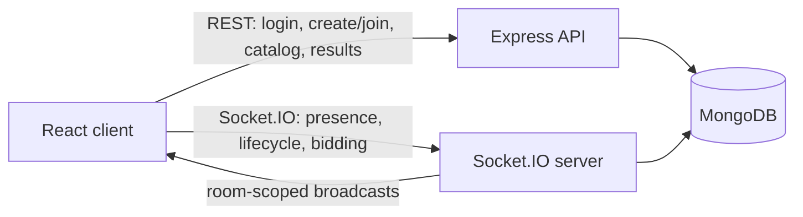

# Mini Realtime Auction Room

A full-stack, server-authoritative auction application. Hosts create a room and prepare its catalog; bidders join with a room code, receive catalog and auction updates through Socket.IO, and place bids on the active item. MongoDB remains the durable source of truth, so a reload can recover the current room state.

**Live demo:** [auction-assignment.vercel.app](https://auction-assignment.vercel.app/)

## Demo flow

1. Open the app and choose **Use Demo Account** (`demo` / `password123`), or enter a guest alias.
2. Create a room to become that room's host, then add one or more items.
3. Open the app in a separate browser profile or incognito window, sign in with a different alias, and join using the room code.
4. Start the auction as the host. Bidders are moved to the live auction and can place bids. The host marks each item sold or unsold to advance the auction.

The two browser sessions need different aliases because a username may only be used once within a room.

## Stack

- Frontend: React 19, TypeScript, Vite, Tailwind CSS, Zustand
- Backend: Node.js, Express, TypeScript, Mongoose
- Realtime: Socket.IO
- Database: MongoDB

## Architecture



- REST creates durable data and returns a per-room `sessionToken` after a room is created or joined.
- Socket.IO authenticates that token during its handshake, joins the client to `room:{code}`, and broadcasts room events only to that room.
- The server validates host permissions, item status, and bid amounts before persisting changes and broadcasting them.
- The browser persists its current room session with Zustand. This is convenience state, not the authoritative auction state; the server rehydrates state from MongoDB on reconnect.

## Assumptions and trade-offs

- A room has one host and one active item at a time.
- Bids are whole rupees and must exceed the current bid by at least ₹1.
- Usernames are unique within a room; use separate browser profiles and different aliases for a realistic multi-user test.
- The server owns the countdown. Its 30-second default is configurable through `AUCTION_ITEM_DURATION_SECONDS`; expiry sells an item with a highest bidder and otherwise marks it unsold.

## Core data model

| Collection | Purpose |
| --- | --- |
| `rooms` | Room code, name, lifecycle status, host participant, and active item |
| `participants` | Room membership, role, opaque session token, and presence |
| `auctionitems` | Catalog entries, current/highest bid, winner, and item status |
| `bids` | Accepted bid history for an item |

## Realtime events

| Direction | Event | Purpose |
| --- | --- | --- |
| Client → server | `room:connect` | Join the room channel and request a fresh state snapshot |
| Client → server | `auction:start` | Host starts the auction and activates the first pending item |
| Client → server | `bid:place` | Bidder submits a bid amount for server validation |
| Client → server | `item:sell`, `item:unsold` | Host resolves the active item |
| Server → client | `room:state` | Fresh room, participant, active-item, and bid snapshot |
| Server → client | `participant:joined`, `participant:left` | Presence changes |
| Server → client | `item:added` | A host-added catalog item |
| Server → client | `auction:started`, `item:activated` | Auction and active-item transitions |
| Server → client | `bid:accepted`, `bid:rejected` | Accepted room-wide update or private validation error |
| Server → client | `item:ended`, `auction:completed` | Resolution and completion updates |

## Run locally

Prerequisites: Node.js 18+ and a MongoDB database (local MongoDB or Atlas).

1. Configure the backend. Copy `backend/.env.example` to `backend/.env`, then set `MONGODB_URI` if you are not using the local default. For a production deployment, also set a long random `JWT_SECRET`; do not commit this file.

2. Configure the frontend. Copy `frontend/.env.example` to `frontend/.env`. `VITE_API_URL` may be either the backend origin (`http://localhost:3001`) or its `/api` URL; the client normalizes both forms.

3. Start the backend:

   ```bash
   cd backend
   npm install
   npm run dev
   ```

4. In another terminal, start the frontend:

   ```bash
   cd frontend
   npm install
   npm run dev
   ```

5. Visit `http://localhost:5173`.

## Test the realtime flow

1. In browser A, create a room and register at least two items.
2. In browser B (a separate profile or incognito window), sign in with another alias and join using the room code.
3. Confirm both lobbies show the same catalog and participant presence.
4. Start the auction in browser A. Both clients should enter the live auction, see the same active item, and receive each accepted bid immediately.
5. Resolve each item as sold or unsold. Both clients should land on the final results page without refreshing.

For concurrent-bid testing, submit different higher bids from two bidder sessions at nearly the same time and confirm that the final amount and winner always equal the highest accepted bid.

## Deployment configuration

Deploy `frontend/` as a Vite static site and `backend/` as a Node web service. The frontend must point `VITE_API_URL` to the deployed backend, and the backend's `CLIENT_URL` must exactly match the deployed frontend origin. Configure these values privately in the hosting provider:

| Service | Required configuration |
| --- | --- |
| Backend | `NODE_ENV=production`, `MONGODB_URI`, `CLIENT_URL`, `JWT_SECRET` |
| Frontend | `VITE_API_URL` |

Build the backend with `npm run build` and start it with `npm start`. Build the frontend with `npm run build`; its output directory is `dist`.

No database connection strings, JWT secrets, or private backend URLs are stored in this README.

## AI usage

The project includes the requested AI evidence in [`ai-transcripts/`](ai-transcripts/):

- `chatgpt-session-1.md` — architecture and milestone prompts
- `cursor-session.md` — scaffold and implementation planning
- `antigravity-session-1.md` — implementation and debugging sessions
- `ai-usage-summary.md` — tools used, manual decisions, and known limitations

## Current limitations

- Bidders do not have budgets or account balances.
- This is a small single-service implementation. A multi-instance deployment would need a shared Socket.IO adapter and distributed timer coordination.
