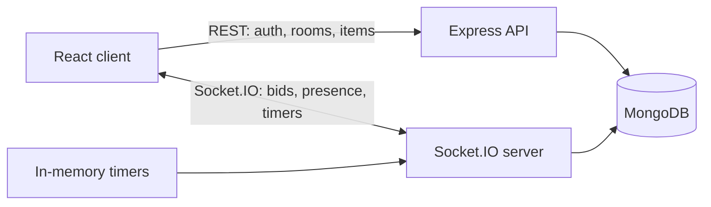

# Mini Realtime Auction Room

A server-authoritative live auction platform. A host creates a private room, prepares a catalog, and runs the auction one item at a time. Bidders join with a room code and bid concurrently against a synchronized countdown. Every state transition is decided by the server and persisted to MongoDB, so a refresh, a disconnect, or a backend restart recovers the room rather than losing it.


---

## Live Demo

- **App:** https://auction-assignment.vercel.app
- **API:** https://live-auction-fhb9.onrender.com

> The backend runs on Render's free tier and sleeps after roughly 15 minutes of inactivity. The first request after an idle period wakes it and can take up to a minute; the app shows an explanatory notice while it waits. Load the app once before demoing to warm it.

## Demo Credentials

| Account | Username | Password |
|---|---|---|
| Bidder | `demo` | `password123` |

Signing in as `demo` issues a unique alias (`demo_a1b2c3`) so the same credentials can drive several browser profiles at once without colliding. You can also register a normal account from the Sign Up tab.

Roles are per-room, not global: whoever creates a room is that room's host, and everyone who joins is a bidder. The same account can host one room and bid in another.

## Tech Stack

**Frontend** — React 19, TypeScript, Vite, Tailwind CSS v4, Zustand, Socket.IO client, React Router
**Backend** — Node.js, Express 5, TypeScript, Mongoose, Socket.IO
**Database** — MongoDB (Atlas)
**Hosting** — Vercel (frontend), Render (backend)
**Testing** — Node.js native test runner

## Features

- **Rooms by code** — create a room, share a six-character code, join from anywhere.
- **Host and bidder roles** — assigned server-side at room creation or join and encoded in a room-scoped session token.
- **Catalog preparation** — the host adds items while the room is in the lobby; every connected client sees them appear live.
- **Bidder budgets** — every bidder starts with the same purse, set when the room is created. A bid cannot exceed what is left, and the winner is debited only when the sale is final, so the auction is a contest of allocation rather than of who types the biggest number.
- **Atomic concurrent bidding** — simultaneous bids are resolved by a single conditional MongoDB update, so exactly one can win.
- **Anti-snipe countdown** — an accepted bid restarts the item's countdown, so a last-second bid cannot win uncontested.
- **Server-owned timers** — deadlines are stored as absolute timestamps and rebuilt on boot, so a restart mid-auction resumes rather than resets.
- **Presence** — live online/offline indicators, with stale flags cleared on startup.
- **Pause and resume** — the host can freeze the countdown mid-item; bidding closes at the database while paused and the clock restarts from the exact remainder.
- **Resolution** — the host can sell or mark unsold at any time; otherwise the timer resolves the item automatically.
- **Results** — a final summary of revenue, items sold, and winners.
- **Degraded mode** — if MongoDB is unreachable the API returns an explicit 503 and the client shows a retryable error instead of hanging.

## Architecture



REST handles anything request/response shaped — authentication, creating and joining rooms, adding catalog items, fetching results. Socket.IO handles everything continuous — presence, bids, item activation, resolution. MongoDB is the only source of truth; the socket layer broadcasts state, it does not own it.

See [ARCHITECTURE.md](ARCHITECTURE.md) for the event map, concurrency control, and schema, and [DECISIONS.md](DECISIONS.md) for the trade-offs behind these choices.

## Realtime Design

Sockets authenticate during the handshake with the room-scoped `sessionToken` issued at create/join, and are joined to a `room:{CODE}` channel. The client never decides anything: it emits intent (`bid:place`, `item:sell`) and renders what the server broadcasts back.

Ordering matters for correctness in two places, both handled at the database rather than in application code:

- A bid is accepted by a conditional update requiring the item to still be active, still be within its deadline, and hold a lower current bid. Concurrent bids at the same amount cannot both match.
- An item is resolved by a conditional update requiring it to still be active, so a host clicking Sell at the same instant a timer expires produces exactly one outcome.

Full event table in [ARCHITECTURE.md](ARCHITECTURE.md).

## Database Schema

Five collections: `users` (global accounts), `rooms`, `participants` (per-room membership and role), `auctionitems`, `bids`. Diagram and field detail in [ARCHITECTURE.md](ARCHITECTURE.md).

## AI Usage

Built with AI assistance. Tooling, prompts, transcripts, and a breakdown of which decisions were directed versus accepted as generated are in [`ai-transcripts/`](ai-transcripts/).

## Running Locally

**Prerequisites:** Node.js 18+, and MongoDB running locally or an Atlas connection string.

```bash
git clone https://github.com/2arnav4/AuctionHub.git
cd "Mini Realtime Auction Room"
```

**Backend**

```bash
cd backend
npm install
cp .env.example .env     # then edit MONGODB_URI and JWT_SECRET
npm run dev              # watch mode on http://localhost:3001
```

**Frontend** (in a second terminal)

```bash
cd frontend
npm install
cp .env.example .env
npm run dev              # http://localhost:5173
```

**Seed a demo room** (optional — creates a room with a prepared catalog and prints how to open it as the host)

```bash
cd backend && npm run seed
```

**Checks**

```bash
cd backend  && npm run lint && npm test    # typecheck, unit + concurrency tests
cd frontend && npm run lint && npm run build
```

The concurrency tests run against whatever `MONGODB_URI` points at and skip themselves if no database is reachable, so `npm test` passes either way.

## Environment Variables

**`backend/.env`**

| Variable | Required | Default | Purpose |
|---|---|---|---|
| `PORT` | no | `3001` | HTTP port. Must be a positive integer. |
| `NODE_ENV` | no | `development` | `production` enables `Secure; SameSite=None` auth cookies, required for a cross-origin deployment. |
| `CLIENT_URL` | no | `http://localhost:5173` | Allowed CORS origin. In development `http://localhost:5173` is always permitted as well. |
| `MONGODB_URI` | no | `mongodb://localhost:27017/auction-room` | Connection string. Any database segment in the path is ignored — `MONGODB_DB_NAME` decides. |
| `MONGODB_DB_NAME` | no | `auction` | Database to use. Set explicitly because a connection string without a database segment silently resolves to `test`, which is how production data ends up somewhere nobody intended. |
| `AUCTION_ITEM_DURATION_SECONDS` | no | `60` | Countdown per item, and the amount an accepted bid restores it to. |
| `DEFAULT_STARTING_BUDGET` | no | `100000` | Purse each bidder starts with when a room does not specify one. |
| `JWT_SECRET` | **yes in production** | dev-only fallback | Signing key. Startup fails if unset when `NODE_ENV=production`. |

**`frontend/.env`**

| Variable | Required | Default | Purpose |
|---|---|---|---|
| `VITE_API_URL` | no | `http://localhost:3001/api` | Backend base URL. A trailing `/api` is optional; the socket client strips it. |

## API

All REST routes are mounted under `/api` and return JSON. Errors use `{ "error": "message" }`.

**Auth**

| Method | Path | Description |
|---|---|---|
| `POST` | `/api/auth/register` | Create an account and sign in. Password must be 8+ characters with upper, lower, digit, and symbol. |
| `POST` | `/api/auth/login` | Sign in and receive an HTTP-only JWT cookie. |
| `POST` | `/api/auth/logout` | Clear the auth cookie. |
| `GET` | `/api/auth/me` | Current user, or `{ "user": null }`. |

**Rooms**

| Method | Path | Description |
|---|---|---|
| `POST` | `/api/rooms` | Create a room. **Requires auth.** The username comes from the cookie, not the body. Returns the room, the host participant, and a `sessionToken`. |
| `POST` | `/api/rooms/:code/join` | Join a room. **Requires auth.** Returns the room, the participant, and a `sessionToken`. |
| `GET` | `/api/rooms/:code` | Room details by code. Public. |
| `GET` | `/api/rooms/:code/results` | Resolved items for a finished auction. |

**Items**

| Method | Path | Description |
|---|---|---|
| `POST` | `/api/rooms/:code/items` | Add a catalog item. Host only, lobby only. Requires the `x-session-token` header. |
| `GET` | `/api/rooms/:code/items` | List a room's catalog. |

**Health**

| Method | Path | Description |
|---|---|---|
| `GET` | `/health` | Always 200 while the process is alive. Body reports `ready`, `database`, and `uptimeSeconds`. |

## Demo Flow

1. Sign in as `demo` / `password123`, create a room, and add two or three items.
2. In a second browser profile or incognito window, sign in as `demo` again and join with the room code. Both windows show the participant list updating live.
3. Click **Start Live Auction**. Both screens move to the auction board with a synchronized countdown.
4. Bid from the bidder window. The host window updates instantly; bids below the current highest are rejected with the required minimum. Each accepted bid restarts the countdown.
5. Click **Pause** on the host window. Both clocks freeze at the same second and the bidder's input is replaced by a paused notice; a bid attempted now is rejected with "Bidding is paused by the host." Click **Resume** and the countdown continues from exactly where it stopped.
6. Let the timer expire or resolve the item manually. The next item activates automatically.
7. When the catalog is exhausted every client is redirected to the results page.

To see the concurrency handling directly, open two bidder windows and submit the same amount at the same moment: exactly one is accepted and the other is told the new minimum.

## Known Limitations

- **Single instance only.** Countdown timers live in an in-memory `Map` keyed by room id. Running two backend instances behind a load balancer would fragment that map, and Socket.IO broadcasts would not reach clients on the other instance. Horizontal scaling needs the Redis adapter plus a shared scheduler. This is the most significant limitation.
- **Cold starts.** The free Render tier sleeps when idle; the first request can take up to a minute.
- **Room reads are deliberately public.** Anyone holding a room code can call `GET /api/rooms/:code` and `/results`. The code is the invitation, and requiring an account to view a shared link would defeat that. Neither route returns a session token, so a code grants visibility and never control. Every write is authorized.
- **No rate limiting** on authentication or bid submission. A determined client can spam `bid:place`; each attempt is validated and rejected correctly, but nothing throttles the attempts.
- **Unbounded anti-snipe.** Every accepted bid restores the full countdown, so two determined bidders can keep an item open indefinitely. A production auction would cap total duration or reset to a shorter window.
- **Tests cover the concurrency primitives, not the transport.** The conditional updates that make bidding and resolution safe are tested against a real MongoDB, but the socket handlers wrapping them are verified manually across browser windows.
- **The auth JWT is readable by JavaScript.** The API is on a different domain than the app, so its cookie is third-party and blocked by default in Chrome incognito and under Safari/Firefox tracking protection. The token is therefore also held client-side and sent as a bearer header, which trades HTTP-only protection for actually working. Serving both from one origin would remove the trade-off — see [DECISIONS.md](DECISIONS.md).
- **Demo accounts share one password.** `demo` / `password123` is a shared reviewer login that mints a distinct alias per sign-in. Convenient for a walkthrough, obviously not an authentication model.

## Future Improvements

- Redis adapter and a distributed scheduler for multi-instance deployment.
- Integration tests for concurrent bids and resolution races.
- Team squads and per-category caps on top of the existing per-bidder budget.
- Bounded anti-snipe: cap total extensions, or reset to a shorter window than the opening one.
- Spectator (read-only) role.
- Chat and reactions in the auction room.

## License

MIT.
