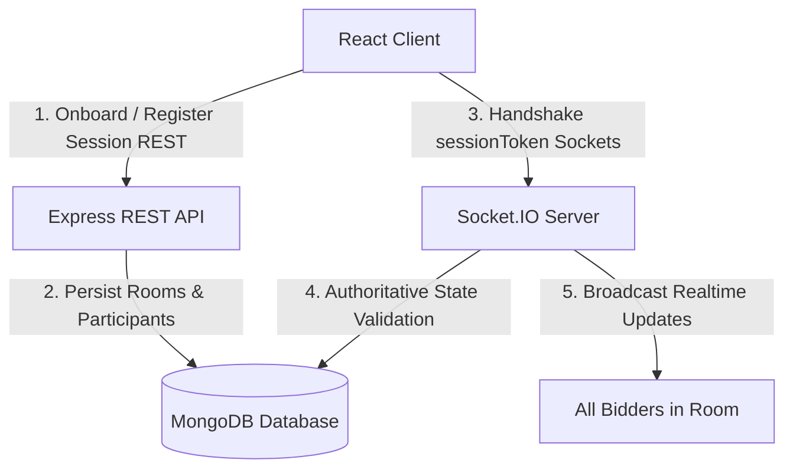

# Walkthrough - Final Milestones: Realtime Bidding & Auction Completion

We have implemented the Realtime Bidding System, host resolutions (sell/unsold), automatic item progression, results collection, and production polish.

---

## 1. Final Architecture

* **Authoritative Server**: The server governs all auction state transitions, bidding checks, and item progressions. Sockets are only allowed to connect by sending valid `sessionToken` inside the handshake auth block.
* **Separation of Concerns**: REST APIs handle user registration and room results retrieval, while Socket.IO handles live bidding logs, presence synchronization, and progression triggers.
* **Persistent Recovery**: Every event changes records inside MongoDB. Reconnecting users recover the exact state (active item details, live participant count, and bid logs) through database queries, preventing data loss.

---

## 2. Complete Auction Lifecycle

1. **Room Creation (Lobby Status)**: Admin sets room metadata, generating invite codes.
2. **Onboarding**: Bidders join with unique usernames. Admin registers auction items.
3. **Auction Launch (Live Status)**: Admin starts the auction. The first item activates, opening bids.
4. **Realtime Bidding**: Bidders place bids. Valid bids trigger updates across all screens.
5. **Item Resolution**: Admin clicks "Sell Item" (marked sold to highest bidder) or "Mark Unsold".
6. **Progression**: The server activates the next pending item, or transitions status to `"completed"` if none remain.
7. **Results (Completed Status)**: Clients transition to the results page, displaying outcomes and total revenue.

---

## 3. Known Limitations

* **No Bid Lock Timers**: Item resolution is host-triggered. In production, adding automatic 10-second countdowns before sell triggers would improve bidder experience.
* **Simple Increments**: The current increment rule requires bids to be at least `currentBid + 1`. Production auctions typically scale minimum increments with bid heights.

---

## 4. Key Interview Explanation Points

* **Authoritative Sockets**: "The server governs all state. Sockets are strictly authenticated via handshake checks against MongoDB session tokens."
* **Hybrid REST + WS**: "REST is optimized for session initialization and outcomes queries, while WebSockets handle high-frequency events like bidding and presence."
* **Unique Key Indexes**: "We enforce unique usernames within rooms via Mongoose compound indexes, preventing naming collisions in the lobby."
* **Reconnection Sync**: "If a network drops, the frontend Zustand store retains the session token. Reconnection requests query MongoDB to restore the active item, bid list, and online badges instantly."
